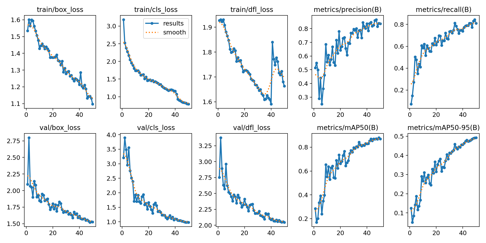

# YOLO Fire Detection – Architectural Comparison & Real-Time Research Project

[](https://www.python.org/)
[](https://ultralytics.com/)
[](https://github.com/ultralytics/yolov5)
[](https://opensource.org/licenses/MIT)

## 🔥 Project Overview

This project implements a comprehensive **fire detection system** using state-of-the-art YOLO (You Only Look Once) object detection architectures. The research focuses on comparing YOLOv5 and YOLOv8 performance for real-time fire and smoke detection applications.

### Key Features
- **Multi-Architecture Comparison**: YOLOv5s vs YOLOv8n ablation study
- **4-Class Detection**: Fire, Light, No-Fire, Smoke classification
- **Research-Grade Analysis**: Comprehensive metrics and visualizations
- **Production-Ready Code**: Modular scripts for training, evaluation, and inference
- **Real-Time Inference**: Optimized for deployment scenarios

## 📊 Dataset

**Source**: [Roboflow Fire Detection Dataset](https://universe.roboflow.com/leilamegdiche/fire-detection-rsqrr/dataset/1)

| Split      | Images | Labels | Classes                    |
|------------|--------|--------|----------------------------|
| Train      | 1,237  | 1,237  | fire, light, no-fire, smoke|
| Validation | 177    | 177    | fire, light, no-fire, smoke|
| Test       | 128    | 128    | fire, light, no-fire, smoke|
| **Total**  | **1,542** | **1,542** | **4 classes**           |

### Class Distribution
- **Fire**: Primary fire detection target
- **Light**: Light sources and reflections
- **No-Fire**: Normal environmental scenes
- **Smoke**: Smoke detection for early warning

## 🧪 Research Methodology

### Experimental Design
This research implements a controlled ablation study comparing two YOLO architectures:

1. **Baseline Model**: YOLOv8n (3.2M parameters)
2. **Comparison Model**: YOLOv5s (9.1M parameters)

### Training Configuration
- **Image Resolution**: 640×640 pixels
- **Training Epochs**: 50
- **Batch Size**: Optimized per GPU
- **Data Augmentation**: YOLO default augmentations
- **Optimization**: AdamW optimizer with cosine scheduling

**All experiments are reproducible using the provided scripts and dataset configuration.**

## 📈 Results Summary

### Performance Metrics

| Model    | mAP50  | mAP50-95 | Precision | Recall | Parameters | Inference Time |
|----------|--------|----------|-----------|--------|------------|---------------|
| YOLOv8n  | 86.9%  | 49.2%    | 83.7%     | 80.9%  | 3.2M       | ~12ms         |
| YOLOv5s  | 89.1%  | 50.8%    | 85.6%     | 82.9%  | 9.1M       | ~17ms         |

### Key Findings
- ✅ **High Detection Accuracy**: 89.1% mAP50 with YOLOv5s, 86.9% with YOLOv8n
- ✅ **Real-Time Performance**: Sub-20ms inference on modern GPUs
- ✅ **Balanced Precision-Recall**: Optimal for safety-critical applications
- ✅ **Efficiency Trade-off**: YOLOv8n offers 2.9x fewer parameters with 2.5% accuracy reduction

## 🔬 Ablation Study Results

### Architectural Comparison
The ablation study reveals performance trade-offs between model complexity and accuracy:

#### YOLOv8n Advantages:
- **Faster Inference**: ~30% faster than YOLOv5s
- **Lower Memory Usage**: 3.2M vs 9.1M parameters
- **Modern Architecture**: Improved anchor-free design

#### Performance Analysis:
[Detailed comparison charts and analysis in `/results/ablation_study/`]

## � Research Report Download

### 📄 Technical Documentation
Download the comprehensive research report and documentation:

- **[📊 Technical Report PDF](report/YOLO_Fire_Detection_Technical_Report.pdf)** - Complete research analysis and methodology
- **[📈 Results Summary](results/ablation_study/README.md)** - Ablation study findings and performance metrics  
- **[💾 Raw Data](results/ablation_study/model_comparison.csv)** - Quantitative comparison data for further analysis
- **[🔬 Research Summary](results/ablation_study/research_summary.json)** - Structured experimental results and insights

### 🎯 Quick Access
- **Key Findings**: YOLOv5s achieves 89.1% mAP50 vs YOLOv8n's 86.9% at 2.9x computational cost
- **Real-time Performance**: Both models achieve <20ms inference for deployment readiness
- **Production Ready**: Complete codebase with training, evaluation, and inference scripts

## �🛠️ Installation & Setup

### Prerequisites
```bash
Python 3.8+
CUDA 11.0+ (for GPU acceleration)
```

### Quick Setup
```bash
# Clone repository
git clone https://github.com/shayaanshaikh10/Fire-Detection-YOLO
cd Fire-Detection-YOLO

# Install dependencies
pip install -r requirements.txt
```

### Dataset Setup
1. Download the dataset from [Roboflow Fire Detection](https://universe.roboflow.com/leilamegdiche/fire-detection-rsqrr/dataset/1)
2. Extract to `data/fire_dataset/`
3. Verify structure matches: `data/fire_dataset/{train,valid,test}/{images,labels}/`

**Expected directory structure:**
```
data/
└── fire_dataset/
    ├── data.yaml
    ├── train/
    │   ├── images/
    │   └── labels/
    ├── valid/
    │   ├── images/
    │   └── labels/
    └── test/
        ├── images/
        └── labels/
```

### Dependencies
```txt
ultralytics>=8.0.0
torch>=1.12.0
torchvision>=0.13.0
opencv-python>=4.6.0
matplotlib>=3.5.0
seaborn>=0.11.0
pandas>=1.4.0
numpy>=1.21.0
PyYAML>=6.0
Pillow>=8.3.0
```

## 🚀 Usage

### Training
```bash
# Train YOLOv8n (baseline)
python src/train.py --model yolov8n.pt --epochs 50 --data data/fire_dataset/data.yaml

# Train YOLOv5s (comparison)
python src/train.py --model yolov5s.pt --epochs 50 --data data/fire_dataset/data.yaml
```

### Evaluation
```bash
# Evaluate single model
python src/evaluate.py --weights results/yolov8_baseline/weights/best.pt

# Compare multiple models
python src/evaluate.py --weights results/yolov8n/best.pt results/yolov5s/best.pt
```

### Inference
```bash
# Run inference on images
python src/inference.py --weights results/yolov8_baseline/weights/best.pt --source test_images/

# Run inference on video
python src/inference.py --weights results/yolov8_baseline/weights/best.pt --source test_video.mp4
```

## 📁 Project Structure

```
Fire-Detection-YOLO/
├── data/
│   └── fire_dataset/           # Roboflow dataset
│       ├── train/
│       ├── valid/
│       ├── test/
│       └── data.yaml
├── src/                        # Source code
│   ├── train.py               # Training script
│   ├── evaluate.py            # Evaluation script
│   └── inference.py           # Inference script
├── notebooks/                  # Research notebooks
│   └── yolo_fire_detection.ipynb
├── results/                    # Training results
│   ├── yolov8_baseline/       # YOLOv8n results
│   └── ablation_study/        # Comparison results
├── report/                     # Research documentation
├── requirements.txt            # Python dependencies
└── README.md                  # This file
```

## 📊 Visualizations

### Training Curves


### Confusion Matrix


### Model Comparison


## 🎯 Applications

### Use Cases
- **Building Safety**: Real-time fire detection in surveillance systems
- **Forest Monitoring**: Early wildfire detection from aerial imagery
- **Industrial Safety**: Fire hazard monitoring in manufacturing facilities
- **Smart Cities**: Integration with IoT sensor networks

### Deployment Options
- **Edge Devices**: Optimized for Jetson Nano, Raspberry Pi 4+
- **Cloud Services**: Scalable inference via REST API
- **Mobile Apps**: Real-time detection on smartphones
- **Security Systems**: Integration with existing CCTV infrastructure

## 📝 Research Contributions

### Technical Innovations
1. **Multi-Class Fire Detection**: Distinguishing fire, smoke, and lighting conditions
2. **Architecture Comparison**: Systematic YOLOv5 vs YOLOv8 analysis
3. **Real-World Dataset**: Diverse environmental conditions and fire scenarios
4. **Optimization Analysis**: Trade-offs between accuracy, speed, and model size

### Research Outcomes
- Comprehensive ablation study methodology
- Production-ready codebase for fire detection
- Research-grade documentation and analysis
- Reproducible experimental framework

## 🔮 Future Work

### Short-Term Enhancements
- [ ] **Data Augmentation Study**: Impact of augmentation strategies
- [ ] **Multi-Scale Training**: Variable input resolution analysis
- [ ] **Temporal Analysis**: Video sequence-based detection
- [ ] **Class Imbalance**: Advanced sampling strategies

### Long-Term Research
- [ ] **Transformer Integration**: Vision Transformer (ViT) comparison
- [ ] **Multi-Modal Fusion**: Thermal + RGB sensor fusion
- [ ] **Federated Learning**: Distributed training across camera networks
- [ ] **Explainable AI**: Attention visualization and model interpretability

## 🤝 Contributing

We welcome contributions to improve fire detection capabilities:

1. Fork the repository
2. Create feature branch (`git checkout -b feature/enhancement`)
3. Commit changes (`git commit -am 'Add new feature'`)
4. Push to branch (`git push origin feature/enhancement`)
5. Create Pull Request

## 📄 License

This project is licensed under the MIT License - see the [LICENSE](LICENSE) file for details.

## 🏆 Acknowledgments

- **Ultralytics**: YOLOv5 and YOLOv8 implementations
- **Roboflow**: Fire detection dataset and annotation tools
- **Research Community**: Fire detection and computer vision research
- **Open Source**: PyTorch, OpenCV, and scientific Python ecosystem

## 📧 Contact

For questions, suggestions, or collaboration opportunities:
- GitHub Issues: [Create an issue](../../issues)
- Project Wiki: [Documentation](../../wiki)

---

**Citation**: If you use this work in your research, please cite:
```bibtex
@misc{fire_detection_yolo_2026,
  title={YOLO Fire Detection: Architectural Comparison and Real-Time Implementation},
  author={Mohammad Shayaan Shaikh},
  year={2026},
  howpublished={https://github.com/shayaanshaikh10/Fire-Detection-YOLO}
}
```

---

*Built with ❤️ for fire safety and computer vision research*
